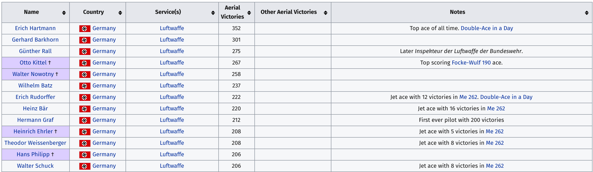
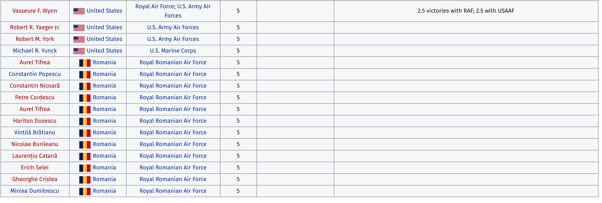

```{r setup, include=FALSE}
library(knitr)
opts_chunk$set(
  collapse = TRUE,
  echo = FALSE,
  tidy = FALSE,
  size = "small")
options(tibble.width = 78)
```

This post covers how to scrape a wikipedia table and store it in an R data frame. 

# The data

I want to download a table of World War II flying aces from [Wikipedia.](https://en.wikipedia.org/wiki/List_of_World_War_II_flying_aces) To do this I will need functions from `xml2`, `rvest`, `dplyr`, `stringr`, `lubridate`, and `readr`.

```{r packages, echo=TRUE, message=FALSE, warning=FALSE}
library(xml2)
library(rvest)
library(tidyverse)
```


## Download html page into object in R

First I want to store the web [url](https://en.wikipedia.org/wiki/URL) into a string vector in R.

```{r wiki_url, echo=TRUE}
wiki_url <- "https://en.wikipedia.org/wiki/List_of_World_War_II_flying_aces"
```

Next I want to use the `xml2::read_html()` function to read the HTML from the webpage.

```{r wiki_page, echo=TRUE}
wiki_page <- xml2::read_html("https://en.wikipedia.org/wiki/List_of_World_War_II_flying_aces")
```

> **Store and explore*** refers to storing an output of a call to an object, then checking the contents of that new object. This is a great way to get to know R and how functions interact with different objects. 

```{r class_wiki_page, echo=TRUE}
utils::str(wiki_page)
utils::head(wiki_page)
```

Ok--still not in a data frame (rectangle) I can use. I need to extract the `table` with `css` selector. 

## Extract `css` tables

`rvest` comes with a handy `html_nodes()` function we can tell to look for the `table`s.

```{r wiki_tables, echo=TRUE}
wiki_tables <- wiki_page %>% rvest::html_nodes(css = "table")
# store and explore!
utils::str(wiki_tables)
utils::head(wiki_tables)
```

If we go back to the wikipedia page and look, the first column in the table we are looking for is named `Name` (for name of the pilot).

I can do a little base R subsetting and `base::grep()` to look for a table with `Name` in a column.

```{r relevant_tables, echo=TRUE}
relevant_tables <- wiki_tables[base::grep(pattern = "Name", x = wiki_tables)]
utils::str(relevant_tables)
utils::head(relevant_tables)
```

Great! Now I am down to one table. I can use the bracket subsetting again `[[]]` and `rvest::html_table()` to find this table and put it in a data frame. 

```{r WW2AcesRAW, echo=TRUE}
WW2AcesRAW <- rvest::html_table(x = relevant_tables[[1]], fill = TRUE)
utils::str(WW2AcesRAW)
```

I'll convert this data frame to a tibble for some fancier manipulation methods. 

```{r as-tibble, echo=TRUE}
WW2AcesRAW <- as_tibble(WW2AcesRAW)
```


## Data checks 

I want to check and make sure these data line up the same way they do in the table on the website.

```{r head, echo=TRUE}
WW2AcesRAW %>% utils::head(10)
```


```{r head_pilots.png, echo=FALSE}

```


```{r tail, echo=TRUE}
WW2AcesRAW %>% utils::tail(10)
```


```{r tail_pilots.png, echo=FALSE}

```

Great! Now I have a dataset with all the ace fighter pilots from WW2. I will export these data to a Github repository [here](https://github.com/mjfrigaard/cloud-projects/tree/master/Data). The other datasets and objects can be removed from the working environment. 


I will export and these as a .csv with a time-stamp. 

```{r export-data}
# create time stamp
readr::write_csv(x = WW2AcesRAW, path = 
                  paste0("WW2AcesRAW-",
                         base::noquote(lubridate::today()),
                         ".csv"))
```

Great! Next post I will visualize these data. 


