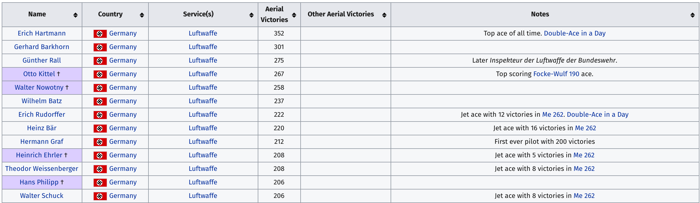
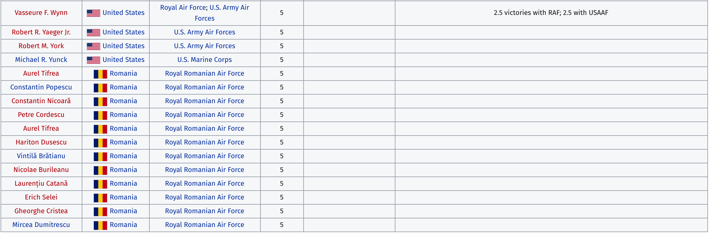

```{r setup, include=FALSE}
library(knitr)
knitr::opts_chunk$set(
  echo = TRUE,
  cache = FALSE,
  prompt = FALSE,
  tidy = FALSE,
  comment = "",
  message = FALSE,
  warning = FALSE,
  size = "vsmall",
  fig.path = "images/"
)
options(tibble.width = 78)
```


> TLDR: This post covers how to scrape a Wikipedia table of World War II (WWII) flying aces, store it in an R data frame, and export these data into a comma-separated values (.csv) file. 

# Flying aces (part 1 of 5)

My grandfather was a WW2 fighter pilot. He belonged to the Flying Tigers, a group of military aviators who served as part of the American Volunteer Group (AVG). He was also a ['flying ace'](https://en.wikipedia.org/wiki/Flying_ace), a distinction typically given to pilots who destroyed or shot down at least five enemy planes. 

Ever since I learned this fact, I've always been fascinated by the variation in aerial victories for flying aces. The highest ranking German Luftwaffe pilot, [Erich Hartmann](https://en.wikipedia.org/wiki/Erich_Hartmann), has 352 victories. As a comparison, highest ranking American pilot, [Richard Bong](https://en.wikipedia.org/wiki/Richard_Bong), had 38 kills. That's a HUGE difference. Do we know why?

We actually know a few contributing factors. For example, an interesting paper in the [National Bureau of Econonomic Research](https://www.nber.org/papers/w22992) investigated how having a flying ace mentioned in a news bulletin (i.e. the public recognition) could lead to higher levels of performance among that unit's best pilots. But this incentive was most effective for expert pilots. Unfortunately, the widespread recognition resulted in many of the unit's average pilots requesting more air missions, and ultimately getting shot down.

I wanted to explore the number of aerial victories by downloading the data in the [WW II flynng aces Wikipedia table](https://en.wikipedia.org/wiki/List_of_World_War_II_flying_aces). This is the first of 5 post exploring this topic. 


# The data

I want to download a table of World War II flying aces from [Wikipedia.](https://en.wikipedia.org/wiki/List_of_World_War_II_flying_aces) To do this I will need functions from `xml2`, `rvest`, `dplyr`, `stringr`, `lubridate`, and `readr`.

```{r packages, echo=TRUE, message=FALSE, warning=FALSE}
library(xml2)
library(rvest)
library(tidyverse)
```


## Download html page into object in R

First I want to store the web [url](https://en.wikipedia.org/wiki/URL) into a string vector in R.

```{r wiki_url, echo=TRUE}
wiki_url <- "https://en.wikipedia.org/wiki/List_of_World_War_II_flying_aces"
```

Next I want to use the `xml2::read_html()` function to read the HTML from the webpage.

```{r wiki_page, echo=TRUE}
wiki_page <- xml2::read_html("https://en.wikipedia.org/wiki/List_of_World_War_II_flying_aces")
```

> **Store and explore*** refers to storing an output of a call to an object, then checking the contents of that new object. This is a great way to get to know R and how functions interact with different objects. 

```{r class_wiki_page, echo=TRUE}
utils::str(wiki_page)
utils::head(wiki_page)
```

OK--still not in a data frame (rectangle) I can use. I need to extract the `table` with `css` selector. 

## Extract `css` tables

`rvest` comes with a handy `html_nodes()` function we can tell to look for the `table`s.

```{r wiki_tables, echo=TRUE}
wiki_tables <- wiki_page %>% rvest::html_nodes(css = "table")
# store and explore!
utils::str(wiki_tables)
utils::head(wiki_tables)
```

If we go back to the wikipedia page and look, the first column in the table we are looking for is named `Name` (for name of the pilot).

I can do a little base R sub-setting and `base::grep()` to look for a table with `Name` in a column.

```{r relevant_tables, echo=TRUE}
relevant_tables <- wiki_tables[base::grep(pattern = "Name", x = wiki_tables)]
utils::str(relevant_tables)
utils::head(relevant_tables)
```

Super! Now I am down to one table. I can use the bracket sub-setting again `[[]]` and `rvest::html_table()` to find this table and put it in a data frame. 

```{r WW2AcesRAW, echo=TRUE}
WW2AcesRAW <- rvest::html_table(x = relevant_tables[[1]], fill = TRUE)
utils::str(WW2AcesRAW)
```

I'll convert this data frame to a tibble for some fancier manipulation methods. 

```{r as-tibble, echo=TRUE}
WW2AcesRAW <- as_tibble(WW2AcesRAW)
```


## Data checks 

I want to check and make sure these data line up the same way they do in the table on the website.

```{r head, echo=TRUE}
WW2AcesRAW %>% utils::head(10)
```


```{r head_pilots.png, echo=FALSE}
# 
```

{width=80%}


```{r tail, echo=TRUE}
WW2AcesRAW %>% utils::tail(10)
```


```{r tail_pilots.png, echo=FALSE}
# 
```

{width=80%}

Rad! Now I have a dataset with all the ace fighter pilots from WW2. I will export these data to a Github repository [here](https://github.com/mjfrigaard/cloud-projects/tree/master/Data). The other datasets and objects can be removed from the working environment. 


I will export and these as a .csv with a time-stamp. 

```{r export-data, echo=TRUE, eval=FALSE}
# create time stamp
readr::write_csv(x = WW2AcesRAW, 
                 path = 
                  paste0(base::noquote(lubridate::today()),
                         "-WW2AcesRAW",
                         ".csv"))
# check
# fs::dir_ls("data")
```

It worked! Next post I will visualize these data. 


